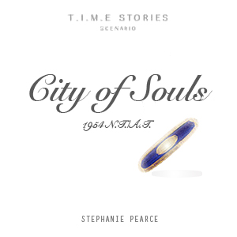

## T.I.M.E Stories package for Octgn

Welcome Time agent! Here you'll find image packages for fan-made expansions of T.I.M.E Stories. If you like an expansion, please make sure to tell the creator on bgg! If you want your expansion or a translation you've made to be added here please contact me (KertanLeGnome) on bgg. You can find an explanation of what I need [here](set) (don't worry, it is really simple).  

All the sets (even some of the official expansions) are distributed with the game package directly when installed in octgn. However, the image packs need to be added or else all cards appears blank. I wont provide image packs for official expansions as I do not have the rights to do so, you will need to scan your own cards. A way to generate image packs from scanned cards can be found [here](scan).  

For an explanation on how to play, please listen to this [video](https://youtu.be/1BfAQhgxoBU).  

## Image packs

# City of Souls
  
**Author:** [Steph Pearce](https://boardgamegeek.com/user/stephaniepa)  
**Setting :** Death Valley, CA USA (1970 N.T.)  
[**Bgg page**](https://boardgamegeek.com/boardgame/263357/city-souls-fan-expansion-time-stories)    
[Image pack](https://drive.google.com/file/d/11Pb02dESu9FR39222rHdFujOPO86GIZ0/view?usp=sharing)   
