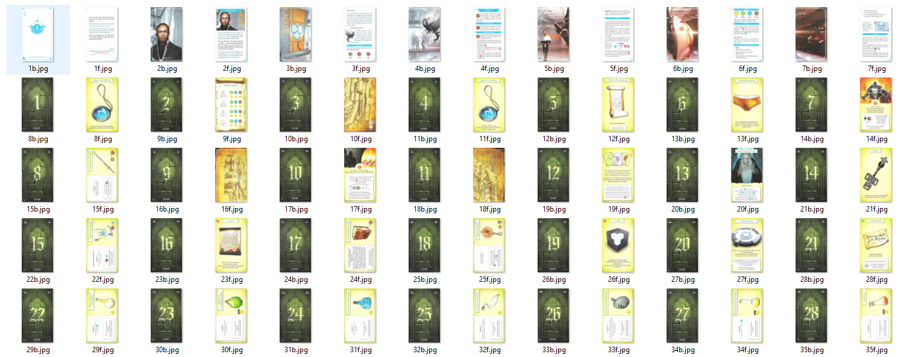

## How to added scanned images in octgn

To add scanned images in octgn you will need a folder containing all the images with all the cards backs numbered 1b, 2b, 3b ... and all the front numbered from 1f, 2f, 3f ...  
The back of the card is the unrevealed side while the front is the revealed side.  

Here is an exemple of what is required:  
.  

You'll also need an installation of [python](https://www.python.org/downloads/).    
Then you can download generate08d.py [here](generateo8d.py).  

Finally you'll need to have the identifier file for the pack you want to generate:  
[Asylum](AsylumUUID.csv)  
[A prophecy of Dragons](ProphecyOfDragonsUUID.csv)  
[Estrella Drive](EstrellaDriveUUID.csv)  

Put generateo8d.py and the identifier file in the same folder as the folder containing the images (not in the folder containing the images!).  
Open generateo8d.py with a text editor like notepad and change the first few lines to match what you want to generate:

fileName = "AsylumUUID.csv" <- name of the identifier file  
imageFolder = "asylumImage/" <- name of the folder containing all your images  
setName = "Asylum"  
language = "French"  

Finally, open a console in the folder containing generateo8d.py and type the command "python ./generateo8d.py". This script should output you with a usable image pack (a file of type o8d called something like Asylum (French).o8d. 
