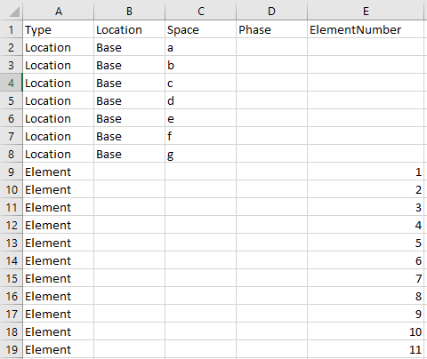
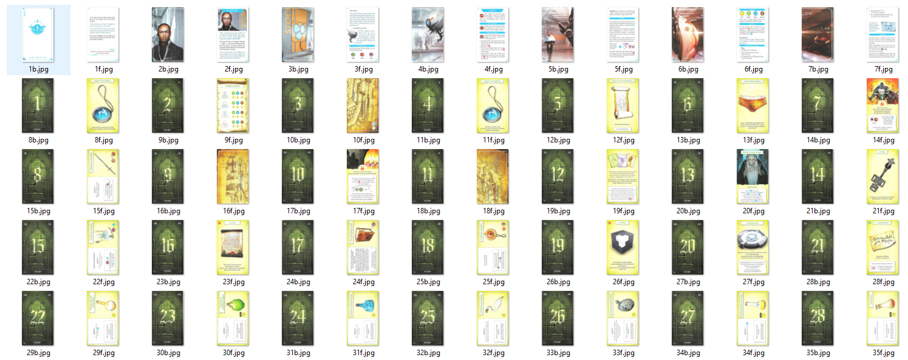

## How to add your expansion in the package

If you have any question or if your expansion doesn't fit with the provided framework, please contact me on bgg to see if I can make it work.  

I only need two things to be able to include your expansion into the game. First of all I need an excel (or equivalent) file containing all the cards in the expansion. Here is an exemple of the file for prophecy of dragon:

There are 5 columns in this excel file, leave unneeded parameters empty.

1. Type of the card
2. Location of the card
3. Space where the card will go
4. Phase where the card is used, if needed
5. The number for element cards

There are several type of cards available to you:
* **Location** Cards that will deploy on the a-h spaces
* **Element** Self-explainatory
* **Plan** Initial map cards
* **Conclusion** Card to read at the end of a run
* **Receptacle** Initial receptacle cards
* **Reminder** Cards use for remembering symbols or special rules
* **CodexX** Cards placed in codex X (1 to 6 for now in case you need more than 4).

Location cards need to have a Location name in the "Location" column, such as "Base" or "Tavern". Players will open location based on this name so make sure it is the same than on the map.  
The Space column is required for "Location" and "Plan" card. For location, it refers to which space (from a to h) where the card will go once the location is opened. For the map cards you need to set "tl", "tr", "bl", "br" repectively for top left, top right, botton left and bottom right map cards.     
If your scenario implement phases such as prophecy of dragon or expedition endurance please indicate the phase number of each location. If you don't provide a phase number it will be accessible during all phases. You can also set phase number for the map cards if you different phases uses a different map. Players won't be able to open location with a different phase than there are on. If you have receptacle, codex, reminder or conclusion cards attached to a specified phase, put them in an empty codex.
Finally for each element card please provide it's nmber so that player can use the in game form to directly retrieve the good element card.

For the images all I need is all the cards backs numbered 1b, 2b, 3b ... and all the front numbered from 1f, 2f, 3f ...  
The back of the card is the unrevealed side while the front is the revealed side. 

Here is an exemple of what is required:
.

The card numbering must match the order of the excel file, so the card number 1 will corespond to the first card describe in the excel. 
